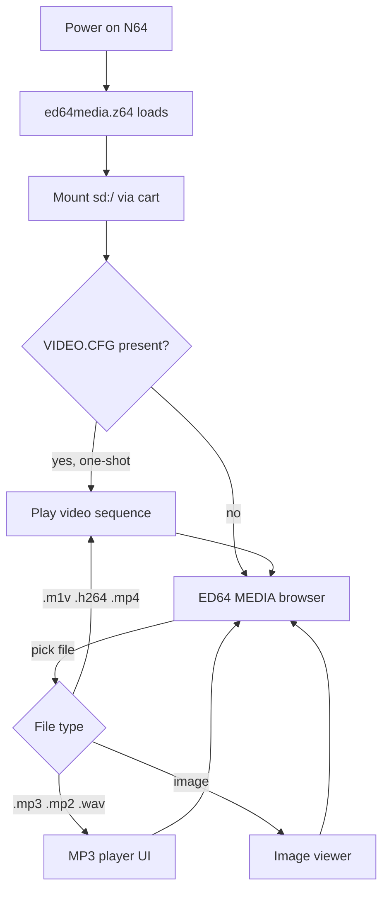

# Media Player 64 — N64 ROM

A **libdragon** homebrew ROM for real Nintendo 64 hardware with an **SD-capable flash cart** (EverDrive 64 / X7, 64drive, SummerCart64, etc.). It browses your SD card and plays **video**, **music**, and **images** from one menu 

The main unified build is **`ed64media.z64`** (`make -f Makefile.ed64combo`).

---

## What runs on the console

| Layer | Role |
|--------|------|
| **Flash cart + FAT32 SD** | Stores the `.z64` ROM and your media files under `sd:/` |
| **libdragon** | SD filesystem, display (320×240), audio mixer, joypad, DFS (`rom:/`) assets |
| **MPEG-1 / H.264** | libdragon FMV (`fmv_play`) decodes elementary streams on the RSP/RDP |
| **minimp3** | Decodes `.mp3` / `.mp2` in software on the CPU |
| **stb_image + gifdec** | Still images and small animated GIFs |
| **This ROM** | File browser, playback UIs, handoff between video / audio / image modes |

**Important:** Most emulators (including Ares) **do not** expose EverDrive-style SD storage to homebrew. Treat this as **hardware-first** software; use a real cart or a setup that emulates SD the way your cart firmware does.

**Toolchain:** Requires **libdragon preview** (FMV APIs are not on stable `trunk`). See [Installing libdragon](https://github.com/DragonMinded/libdragon/wiki/Installing-libdragon) and `. ./env.sh` in this repo.

---

## How it works (high level)



1. **Boot** — Initializes joypad, SD, audio, and video codecs (MPEG-1 + H.264).
2. **Optional autoplay** — If `sd:/ED64P/VIDEO.CFG` or `sd:/ED64/VIDEO.CFG` exists, the ROM plays that path once, then **deletes** the config so the next boot returns to the menu.
3. **Browser** — Lists folders and supported files on `sd:/` (and subfolders). Sidecar `.wav` / `.wav64` files paired with video are **hidden** from the list but used during FMV playback.
4. **Playback** — Selecting a file tears down the menu display, runs the correct player (`sd_player.c` or `sd_mp3_player.c`), then reloads the menu at the same folder.

Media stays on the SD card; the ROM is only the player engine plus small `rom:/` UI sprites and help text.

---

## SD card setup

1. Format the SD card as **FAT32**.
2. Copy **`MediaPlayer64.z64`** to your cart’s homebrew path (firmware-dependent), for example:
   - EverDrive 64 (classic): `ED64/`
   - EverDrive 64 / X7 (Plus): `ED64P/` or the path your firmware documents for “load ROM from SD”
3. Put media anywhere on the card, e.g. `sd:/videos/`, `sd:/music/`, `sd:/pics/`.
4. (Optional) For **autoplay on boot**, create a one-line config (deleted after use):

   ```text
   video=sd:/path/to/clip.m1v
   ```

   Paths: `sd:/ED64P/VIDEO.CFG` or `sd:/ED64/VIDEO.CFG`. You can also use a `.mp4` **catalog name** if `clip.h264` or `clip.m1v` exists beside it.

### Preparing files on a PC

The N64 does **not** demux MP4 or decode AAC. Use the scripts in this repo on a computer:

| Goal | Tool |
|------|------|
| Video for SD / ROM | `./scripts/video2n64.py`, `./scripts/encode_video.sh`, or `scripts/mp4_demux_for_n64.sh` |
| AAC / M4A → MP3 | `scripts/sd_music_from_aac_m4a.sh` |
| Long episodes in parts | `video2n64.py --chunk-auto` → `name_part001.m1v`, … |

Details: root **`README.md`** (converter section) and **`PACKAGING.md`**.

---

## Supported file types

### Video (FMV)

| Extension | On-card role |
|-----------|----------------|
| **`.m1v`** | MPEG-1 elementary stream (primary format) |
| **`.h264`** | Raw Annex-B H.264 elementary stream |
| **`.mp4`** | **Catalog label only** — listed if the same stem has `.m1v` or `.h264`; playback uses the elementary file |
| **`.wav64`** | Optional VADPCM audio sidecar (same base name as video) |
| **`.wav`** | Optional PCM audio sidecar (same base name); hidden from browser when paired with video |

**Chunked episodes:** `show_part001.m1v`, `show_part002.m1v`, … — only `part001` appears in the list; the player chains parts automatically.

**No sidecar audio:** Entries show **`~`** after `[V]` in the browser; video still plays (silent).

### Music

| Extension | Notes |
|-----------|--------|
| **`.mp3`**, **`.mp2`** | Decoded with minimp3 |
| **`.wav`** | PCM playback (also listed as `[W]` when not an FMV sidecar) |

**Not supported on-console:** `.m4a`, `.aac` — transcode on PC first.

**ID3:** Title, artist, album, duration (when present); embedded **cover art** (APIC); lyrics from **USLT** (unsynced) or **SYLT** (synced).

**Optional folder wallpaper** (visualizer mode 7): place beside the track:

- `mp3_bg.jpg`, `mp3_bg.png`, `mp3_bg.gif`, etc. (see `sd_mp3_player.c`)

### Images

`.jpg`, `.jpeg`, `.png`, `.bmp`, `.gif`, `.tga`, `.psd`, `.hdr`, `.pic`, `.ppm`, `.pgm`, `.pnm`

**GIF:** Animated when the decoded size fits internal limits; otherwise a static decode may be used.

---

## Build the ROM

```bash
. ./env.sh
make -f Makefile.ed64combo ed64media.z64
```

Output: **`MediaPlayer64.z64`** in the repository root (512 KiB typical).

Other targets in this repo (not the unified menu):

| Command | Output | Purpose |
|---------|--------|---------|
| `make` | `n64video.z64` | Single bundled demo clip in ROM |
| `make sdvideo` | `sdvideo.z64` | SD video-only browser |
| `make sdmp3` | `sdmp3.z64` | SD music + images only |

---

## Features (complete list)

### File browser (unified menu)

- Navigate **`sd:/`** and subfolders (directories sorted first, then by name)
- **7-line** scrolling list with **L / R / Z** page jumps
- **Type tags:** `[V]` video, `[M]` MP3/MPEG audio, `[W]` WAV music, `[I]` image
- **`~`** on `[V]` when no `.wav64` / `.wav` sidecar exists
- **N64-style header** strip (`rom:/ui/MenuHeader.sprite`)
- **Layered UI** (backdrop bands, framed list panel, gold/muted text styles)
- **4-page control guide** in-ROM (**C-Up** to open; **B** or **C-Up** to close; **L / R / Z** to change page)
- **RAM size** shown on standalone `sdvideo` menu (not on combo title line)
- **Mirza-style icons** in `sdvideo` list (folder / play / mute); combo menu uses compact `>` selection

### Video playback (FMV)

- **MPEG-1** and **H.264** elementary decode
- **`.wav64`** (VADPCM) or **`.wav`** (PCM) sidecar audio with A/V sync
- **Pause / resume** (**A**) with **wav64 resync** after unpause
- **Stop** (**B**) returns to browser
- **Seek ±10 seconds** (D-pad Left/Right); **hold** to repeat seek
- **Mute** (**Z**) — mixer volume only; decode continues so sync is kept
- **On-screen icon bar** when paused (prev / play-pause / next / stop / mute)
- **Multi-part** auto-advance for `_partNNN` / `-partNNN` naming
- **MP4 catalog** resolution to `.h264` or `.m1v`
- **Expansion Pak–aware** frame skipping when using `.wav64` on 4 MiB systems
- **One-shot `VIDEO.CFG`** autoboot and optional Altra64 / engine handoff (`ALTRA64_INTEGRATION.md`)
- **CRT margin** option in FMV parameters

### Music playback

- **MP3 / MP2** decode (minimp3)
- **PCM WAV** decode with correct sample-rate mixer setup
- **ID3v2** metadata: title, artist, album, track length estimate
- **Embedded album art** display
- **Lyrics panel:** unsynced (USLT) or time-synced (SYLT)
- **Progress bar** and elapsed / total time
- **Pause** (**A** / **Start**)
- **Seek ±5 seconds** (**L** / **R**) when duration is known
- **8 visualizer / background modes** (**C-Up** / **C-Down** cycle, **C-Left** reset):
  - Default spectrum-style bars
  - Color-shifted bars
  - Dual-row color bars
  - Psychedelic tile background
  - Alternating panel colors
  - Particle-style boxes
  - (Modes use tick-based animation tied to playback time)
  - **Folder wallpaper** mode (`mp3_bg.*` in same directory as track)
- **End-of-track** detection and return to menu

### Image viewer

- Decode and **center** image in 320×240 viewport
- **GIF animation** when within size limits (gifdec)
- **Previous / next** image in same folder (**L** / **R** or D-pad Left/Right)
- **Back** (**B** or **Start**)
- **Hold B ~0.5 s** force-exit failsafe
- Safe **display handoff** back to rdpq menu (buffer drain for flash carts)

### ROM assets (`rom:/`)

- UI sprites: Play, Pause, Stop, next, previous, Folder, Mute, MenuHeader
- `ed64_media_help.txt` (short pointer; full help is on-screen)

### Integration / ecosystem

- **`sd_fmv_container.c`** — shared rules for MP4 catalog, elementary hiding, path resolution
- **Altra64** can launch `SDVIDEO.Z64` with `VIDEO.CFG` (see `ALTRA64_INTEGRATION.md`)
- **PC tools:** `video2n64.py` GUI/CLI, Windows `.exe` packaging (`PACKAGING.md`)
- Optional **SM64 painting bridge** (separate ROM / config — not part of `ed64media` binary)

---

## Controls

### File browser (`ed64media.z64`)

| Button | Action |
|--------|--------|
| **D-Up / D-Down** | Move selection |
| **L / R / Z** | Page up/down in list |
| **A** or **Start** | Open folder or play file |
| **B** | Parent folder |
| **C-Up** | Open **Control guide** (4 pages) |

**In help:** **B** or **C-Up** close; **L / R / Z** change page.

### FMV playback

| Button | Action |
|--------|--------|
| **A** | Pause / resume |
| **B** | Stop (back to menu) |
| **D-Left / D-Right** | Seek ±10 s (hold to repeat) |
| **Z** | Mute / unmute (when audio sidecar exists) |

### Music playback

| Button | Action |
|--------|--------|
| **B** | Stop (back to menu) |
| **A** or **Start** | Pause / resume |
| **L / R** | Seek ±5 s |
| **C-Up / C-Down** | Next / previous visualizer mode |
| **C-Left** | Reset visualizer to default |

### Image viewer

| Button | Action |
|--------|--------|
| **B** or **Start** | Back to menu |
| **L / R** or **D-Left / D-Right** | Previous / next image |
| **Hold B** (~½ s) | Force exit |

### Bundled demo ROM (`n64video.z64`)

| Button | Action |
|--------|--------|
| **A** or **Start** | Stop and exit |
| **Z** | Mute / unmute (if `movie.wav64` present) |

---

## Source code map

| File | Responsibility |
|------|----------------|
| `sd_ed64_combo_menu.c` | Main entry, unified browser, input routing |
| `sd_ed64_menu_ui.c` | Menu chrome + 4-page help renderer |
| `sd_menu_topbar.c` | Header sprite blit |
| `sd_combo_shared.c` | Shared UI font (combo build only) |
| `sd_player.c` | SD FMV browser (standalone), `fmv_play`, OSD, chunks, `VIDEO.CFG` |
| `sd_mp3_player.c` | MP3/WAV player, image viewer, ID3/lyrics UI |
| `sd_fmv_container.c` | Video catalog / MP4 / path resolution helpers |
| `main.c` | ROM-embedded `n64video` demo |
| `Makefile.ed64combo` | Builds `ed64media.z64` |

Built with **`-DSD_ED64_COMBO_MENU`** so `sd_player.c` and `sd_mp3_player.c` export `sd_fmv_play_sequence`, `sd_mp3_play_file`, and `sd_mp3_view_image` instead of separate `main()` functions.

---

## Typical encode settings (video)

Libdragon targets **320×wide** MPEG-1, multiples of 32×16, ~24 fps, ~800 kbps as a starting point:

```bash
ffmpeg -i input.mp4 -vb 800K -vf 'scale=320:-16' -r 24 output.m1v
```

Then create matching audio:

```bash
ffmpeg -i input.mp4 -vn -acodec pcm_s16le -ar 32000 -ac 1 output.wav
audioconv64 -o . output.wav   # → output.wav64
```

Or use `./scripts/video2n64.py` to do both steps.

---

## License & credits

- **libdragon** — [DragonMinded/libdragon](https://github.com/DragonMinded/libdragon) (preview branch for FMV)
- **minimp3** — bundled under `vendor/minimp3/`
- **gifdec** — bundled under `vendor/gifdec/`
- **Menu icons** — derived from Mirza icon set (see `assets/mirza_icons/`, `Makefile.sd_ui.inc`)
- **stb** — image decode (SpaghettiKart vendor path)

This repository also contains unrelated experiments (SM64 decomp hooks, MK64 texture tools, split-screen demo, etc.); those are **not** required to use the media player ROM.

---

## Quick troubleshooting

| Problem | Check |
|---------|--------|
| Black screen / no SD | FAT32, cart supported by libdragon, real hardware |
| Video plays, no sound | Add matching `.wav64` or `.wav`; `~` means no sidecar found |
| `.mp4` won’t play alone | Demux to `.m1v` or `.h264` on PC; keep `.mp4` only as a label |
| AAC / M4A silent fail | Transcode to MP3 or WAV on PC |
| Build fails | libdragon **preview**, `N64_INST` set via `. ./env.sh` |
| No `ed64media.z64` after build | Run `make -f Makefile.ed64combo ed64media.z64` and fix compile errors |

For the full repo (converters, Windows GUI, roadmap): see **[README.md](README.md)** and **[FIRMWARE_ROADMAP.md](FIRMWARE_ROADMAP.md)**.
