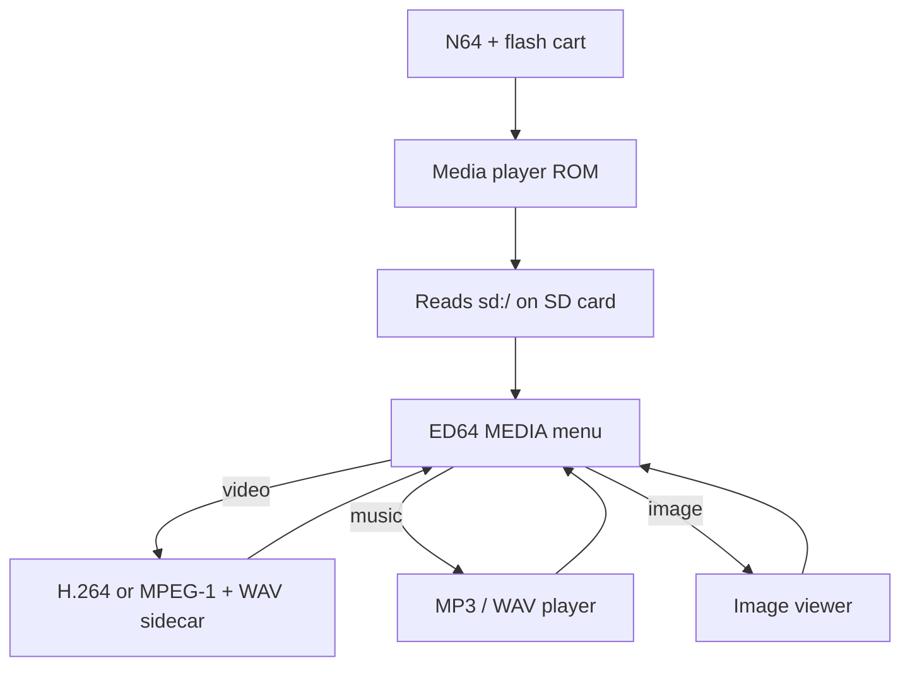

# N64 Media Player

Play **videos**, **music**, and **pictures** from your flash cart’s **SD card** on a real Nintendo 64 (EverDrive 64, EverDrive X7, 64drive, SummerCart64, etc.).

**No libdragon install needed** if you only want to convert files on your PC and copy them to the card.

---

## Quick start (beginners)

### What you need

| On the N64 | On your PC |
|------------|--------------|
| Flash cart with **FAT32** SD card | **Python 3** + **ffmpeg** (for converting video) |
| The player ROM (see below) | Your video / MP3 / image files |

> **Emulators:** Most emulators do **not** show the cart’s SD card to homebrew. Use **real hardware** (or a cart-specific setup).

### 5 steps

1. **Download the ROM** from the latest release:  
   **[N64 Media Player V2](https://github.com/lewilou22/N64-Media-Player/releases/tag/V2)**  
   Get **`MediaPlayer_64.z64`** (512 KB player ROM).

2. **Put the ROM on your SD card**  
   Copy `MediaPlayer_64.z64` where your cart expects homebrew (often `ED64/` or `ED64P/` — check your EverDrive manual).

3. **Convert a video on your PC** (see [Convert video (V2)](#convert-video-v2--recommended) below)  
   You get two files with the **same name**, for example:
   - `myclip.h264` — video  
   - `myclip.wav` — audio  

4. **Copy those files** (and any MP3s / images) onto the SD card — any folder is fine, e.g. `videos/`, `music/`.

5. **On the N64:** boot the ROM → browse with the D-pad → **A** to play.  
   Press **C-Up** in the menu for the full control guide.

---

## Convert video (V2) — recommended

**[Release V2](https://github.com/lewilou22/N64-Media-Player/releases/tag/V2)** adds an updated **video + audio conversion** tool. It turns a normal file (MP4, MKV, AVI, …) into N64-ready **`.h264` + `.wav`** sidecars. You do **not** need libdragon on your PC for this step.

### What it produces

| File | Purpose |
|------|---------|
| **`name.h264`** | H.264 video (320px wide, N64-friendly settings) |
| **`name.wav`** | PCM audio (mono, 32 kHz) — paired with the video |

Put **both** files in the **same folder** on the SD card. The player hides the `.wav` in the list and uses it automatically during playback.

### Option A — download the release zip

From **[V2 assets](https://github.com/lewilou22/N64-Media-Player/releases/tag/V2)** download:

- `MediaPlayer_64.z64` — ROM  
- `split_media_gui.py`, `split_media_lib.py`, `Run_N64_Media_Split.bat` — converter  
- `MediaPlayer64.md` — extra notes  

**Windows:** install [Python 3](https://www.python.org/downloads/) (check “Add to PATH”) and [ffmpeg](https://www.gyan.dev/ffmpeg/builds/), then double-click **`Run_N64_Media_Split.bat`**.

### Option B — use the copy in this repo

Same tools live here:

```text
scripts/n64-media-split/
```

**GUI (Windows):**

```bat
cd scripts\n64-media-split
Run_N64_Media_Split.bat
```

**GUI (Mac / Linux):**

```bash
cd scripts/n64-media-split
python3 split_media_gui.py
```

**Command line:**

```bash
cd scripts/n64-media-split
python3 split_media_cli.py -o ~/Videos/n64-out /path/to/episode.mp4
```

Default encode: **320px** wide, **H.264 baseline**, **800k** video, **mono 32 kHz** WAV. Adjust in the GUI if needed.

More detail: [`scripts/n64-media-split/README.md`](scripts/n64-media-split/README.md).

### Optional: `.wav64` instead of `.wav`

The ROM also accepts **`.wav64`** (libdragon VADPCM, smaller / often smoother on 4 MB consoles). After V2 gives you a `.wav`, convert it with **`audioconv64`** from the [libdragon toolchain](https://github.com/DragonMinded/libdragon/wiki/Installing-libdragon), or the standalone **`audioconv64`** bundle from the [V1.02 release](https://github.com/lewilou22/N64-Video-Player/releases/tag/V1.02). Keep the **same base name** as the `.h264` file.

### Music and images (no converter needed)

Copy these straight to the SD card:

- **Music:** `.mp3`, `.mp2`, `.wav` (not `.m4a` / `.aac` — convert to MP3 on PC first)  
- **Images:** `.jpg`, `.png`, `.gif`, `.bmp`, and other common types (see [Supported files](#supported-files))

---

## Controls (summary)

| Where | Buttons |
|-------|---------|
| **File menu** | D-pad move · **A** open/play · **B** up folder · **L/R/Z** page · **C-Up** help |
| **Video** | **A** pause · **B** stop · **D-L/R** seek ±10 s · **Z** mute |
| **Music** | **B** stop · **A** pause · **L/R** seek · **C-Up/Down** visualizer |
| **Pictures** | **B/Start** back · **L/R** prev/next |

Full 4-page guide is **in the ROM** (**C-Up** on the file menu).

---

## Supported files

### Video

| Extension | Notes |
|-----------|--------|
| **`.h264`** | From V2 converter (recommended) |
| **`.m1v`** | MPEG-1 (older tools / `video2n64.py`) |
| **`.mp4`** | **Label only** if `same_name.h264` or `same_name.m1v` exists |
| **`.wav` / `.wav64`** | Audio sidecar (same base name; hidden in browser) |

**`~` after [V]** = video has no audio sidecar (plays silent).

**Long videos:** split into parts on PC (`name_part001.h264`, `name_part002.h264`, …). The menu shows only part 1 and plays the chain automatically.

### Music

`.mp3`, `.mp2`, `.wav` — ID3 tags, cover art, lyrics (USLT/SYLT), 8 visualizer modes.

### Images

`.jpg`, `.png`, `.gif`, `.bmp`, `.tga`, and more — slideshow in the folder; small GIFs animate.

---

## How it works on the N64



- **libdragon** handles the SD filesystem, 320×240 display, audio mixer, and FMV decode.  
- **minimp3** plays MP3/MPEG audio.  
- **stb + gifdec** decode stills and GIFs.  
- Media stays on the **SD card**; the ROM is only the player (~512 KB) plus small menu graphics in `rom:/`.

**Optional autoplay:** create `sd:/ED64P/VIDEO.CFG` or `sd:/ED64/VIDEO.CFG` with one line:

```text
video=sd:/path/to/clip.h264
```

The ROM plays it once, then deletes the config.

---

## Features

### File browser

- Browse all folders on `sd:/`
- Tags: **[V]** video · **[M]** MP3 · **[W]** WAV · **[I]** image
- N64-style header bar, framed list, gold/muted UI
- **C-Up** → 4-page control guide in-ROM

### Video playback

- H.264 and MPEG-1 elementary streams
- PCM `.wav` or VADPCM `.wav64` sidecar audio with sync
- Pause, seek ±10 s, mute, multi-part episodes
- MP4 “catalog” filenames when elementary file exists

### Music playback

- MP3/MP2/WAV, ID3 metadata, album art, synced/unsynced lyrics
- Progress bar, pause, seek ±5 s, 8 visualizer modes
- Optional folder wallpaper: `mp3_bg.jpg` next to the track

### Image viewer

- Centered scaling, folder slideshow, animated GIFs when size allows

---

## Build the ROM from source (developers)

Requires **libdragon preview** (FMV is not on stable trunk). See [Installing libdragon](https://github.com/DragonMinded/libdragon/wiki/Installing-libdragon).

```bash
. ./env.sh
make -f Makefile.ed64combo ed64media.z64
```

Output: **`ed64media.z64`** (same player as the release ROM; you may rename it when copying to SD).

Other builds in this repo:

| Command | Output | Purpose |
|---------|--------|---------|
| `make` | `n64video.z64` | Demo with one clip baked into ROM |
| `make sdvideo` | `sdvideo.z64` | SD video-only browser |
| `make sdmp3` | `sdmp3.z64` | SD music + images only |

---

## Older conversion tools (optional)

This repo also includes **MPEG-1** pipelines if you prefer `.m1v` + `.wav64`:

| Tool | Use |
|------|-----|
| [`scripts/video2n64.py`](scripts/video2n64.py) | CLI: `.m1v` + `.wav64`, chunking, ROM packing |
| [`scripts/video2n64_gui.py`](scripts/video2n64_gui.py) | GUI for the same |
| [`scripts/encode_video.sh`](scripts/encode_video.sh) | Simple ffmpeg → `filesystem/movie.m1v` |
| [`scripts/mp4_demux_for_n64.sh`](scripts/mp4_demux_for_n64.sh) | Demux MP4 → `.h264` + `.wav` |
| [`scripts/sd_music_from_aac_m4a.sh`](scripts/sd_music_from_aac_m4a.sh) | AAC/M4A → MP3 for SD |

Windows standalone GUI: see **[PACKAGING.md](PACKAGING.md)**.

---

## Project layout (code)

| File | Role |
|------|------|
| `sd_ed64_combo_menu.c` | Main menu, routes to players |
| `sd_ed64_menu_ui.c` | Menu chrome + help screens |
| `sd_player.c` | FMV playback, `VIDEO.CFG`, chunks |
| `sd_mp3_player.c` | Music + image viewer |
| `sd_fmv_container.c` | MP4 catalog / path rules |
| `scripts/n64-media-split/` | **V2** `.h264` + `.wav` converter |

---

## Troubleshooting

| Problem | What to try |
|---------|-------------|
| Black screen / no files | Real N64 + FAT32 SD; not most emulators |
| Video, no sound | Add matching `.wav` or `.wav64`; `~` means no sidecar |
| `.mp4` won’t play by itself | Use V2 converter; keep `.mp4` only as a label beside `.h264` |
| AAC / M4A won’t play | Convert to MP3 on PC |
| Converter fails | Install ffmpeg; add to PATH |
| Build fails | libdragon **preview**, run `. ./env.sh` |

---

## More documentation

- **[FIRMWARE_ROADMAP.md](FIRMWARE_ROADMAP.md)** — future firmware / engine plans  
- **[ALTRA64_INTEGRATION.md](ALTRA64_INTEGRATION.md)** — EverDrive menu handoff via `VIDEO.CFG`  
- **[PACKAGING.md](PACKAGING.md)** — Windows `.exe` for older FMV converter GUI  
- **[docs/WSL2_LIBDRAGON_SETUP.md](docs/WSL2_LIBDRAGON_SETUP.md)** — WSL2 + libdragon for developers  

## Credits

- [libdragon](https://github.com/DragonMinded/libdragon) (preview) — N64 SDK used by the ROM  
- [minimp3](vendor/minimp3/) · [gifdec](vendor/gifdec/) · menu icons under `assets/mirza_icons/`  

This repository also contains separate experiments (SM64 hooks, MK64 tools, demos) that are **not** required for the media player.
